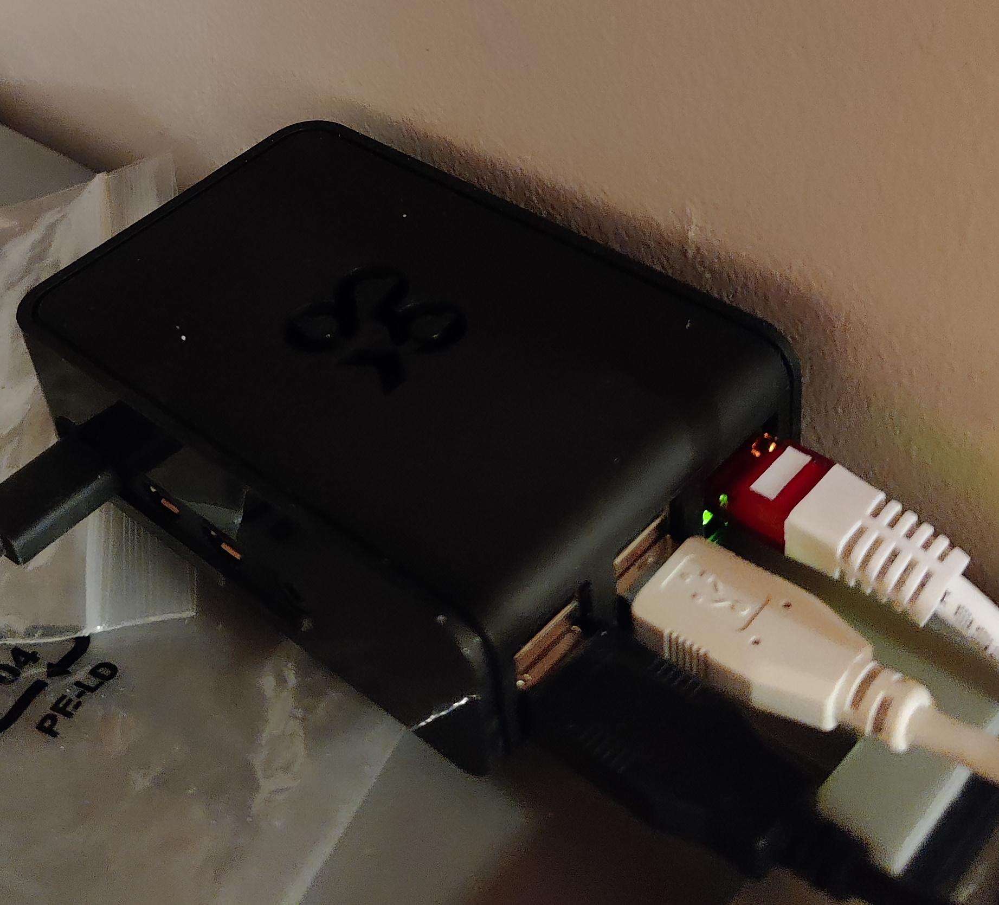
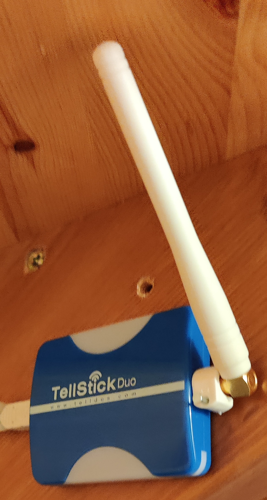
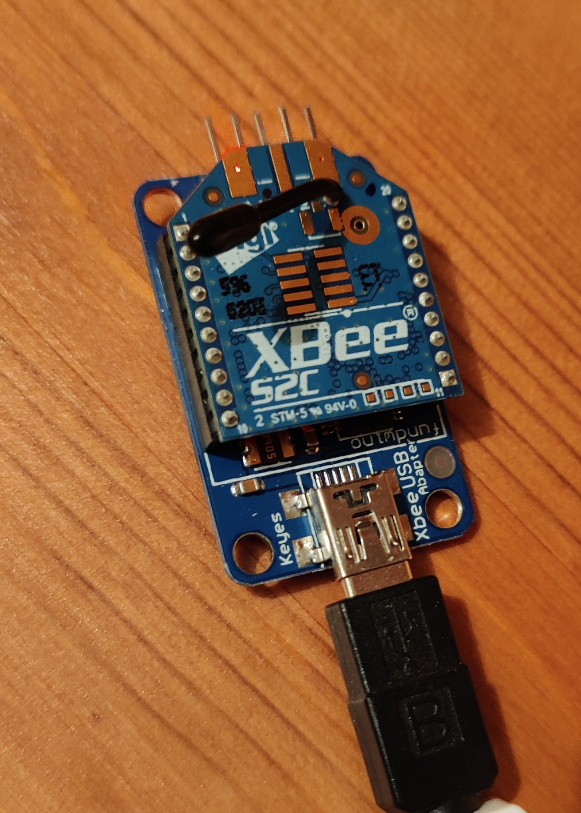
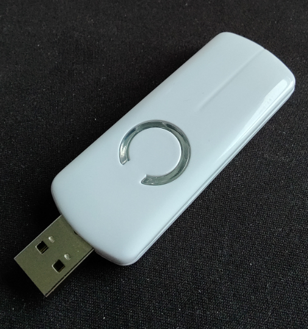
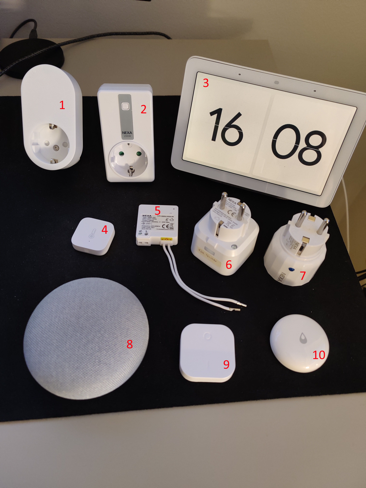

# Summary of components
## Component list

| Name                         | # of items | Cost SEK | Function               | System | Pic. Ref   | Comment                                         |
| ---------------------------- | ---------: | -------: | ---------------------- | ------ | ---------- | ----------------------------------------------- |
| Raspberry Pi 4               |          1 |          | Home Assistant Hub     |        | Pic. 1     | Most running in Docker                          |
| Tellstick Duo                |          1 |          | Controller             | 433    | Pic. 2     | To controll old devices                         |
| XBee S2C                     |          1 |          | Controller             | Zigbee | Pic. 3     | + USB-adapter                                   |
| Aeotec Z-Stick               |          1 |          | Controller             | Z-Wave | Pic. 4     |                                                 |
| Nexa PBR-2300                |          5 |          | On-Off lamps           | 433    |            | For lamps without dimmer.                       |
| Ikea Trådfri outlet          |          1 |       99 | On-Off lamps           | Zigbee | Pic. 5 #1  | For testing of Zigbee network                   |
| EYCR-201 Dimmer              |          2 |          | On-Off/Dim lamps       | 433    | Pic. 5 #2  | For lamps with need of dimmer                   |
| Google Nest                  |          1 |          |                        |        | Pic. 5 #3  | Dashboard in the hall to easily manage the home |
| Aqara Temp & Humidity Sensor |          7 |      199 | Temp & Humidity Sensor | Zigbee | Pic. 5 #4  | Outside, in rooms, in fridge and freezer        |
| Nexa WMR-252                 |          4 |          |                        | 433    | Pic. 5 #5  | Not installed.                                  |
| Nexa MYCR-250 Dimmer         |          3 |          | On-Off/Dim lamps       | 433    | Pic. 5 #6  |                                                 |
| Nexa AD-147 Dimmer           |          1 |          | On-Off/Dim lamps       | Z-Wave | Pic. 5 #7  | For testing of Z-Wave network                   |
| Google Home mini             |          2 |          |                        |        | Pic. 5 #8  | Voice control                                   |
| Ikea Trådfri button          |          1 |       69 |                        | Zigbee | Pic. 5 #9  |                                                 |
| Water Leak Sensor            |          5 |      199 |                        | Zigbee | Pic. 5 #10 | Under household appliances                      |
| Sonos One Gen 2              |          3 |          |                        |        |            | Voice control + Music                           |
| Sonos Beam                   |          2 |          |                        |        |            | Voice control + Music + TV sound                |

## Component Images

| Pic. # | Image                                           |
| ------ | ----------------------------------------------- |
| 1      |    |
| 2      |  |
| 3      |       |
| 4      |   |
| 5      |     |